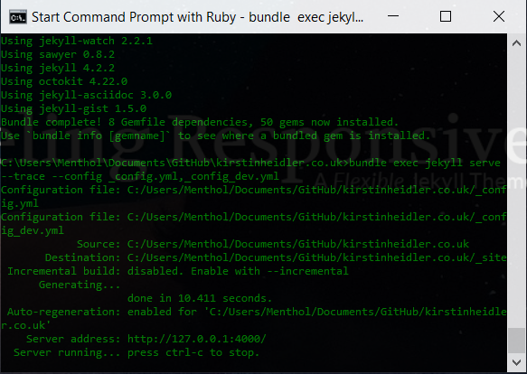

# kirstinheidler.co.uk

This is the source code for Kirstin Heidler.

## A Responsive Jekyll Theme: *Feeling Responsive*

This website uses the 
[Feeling Responsive Jekyll Theme](https://github.com/Phlow/feeling-responsive).
Do you want to get to know *Feeling Responsive*? Than check it out first and have a look on its home at  <http://phlow.github.io/feeling-responsive/>.

To get to know *Feeling Responsive* check out all the features explained in the [documentation][1].

And what license is *Feeling Responsive* released under? [This one][2].

## Development Setup

Install [Ruby and Jekyll](https://jekyllrb.com/docs/installation/windows/).
Open a console with Ruby.

```
cd kirstinheidler.co.uk
gem install bundler
bundle install
```

To run it:

```
bundle exec jekyll serve --trace --config _config.yml,_config_dev.yml -d ../_site
```

Then, you can open the website at [localhost:4000](http://localhost:4000/).




## Structure

You can find the images and other big static files in 
[kirstinheidler.co.uk-data](https://github.com/kirstin/kirstinheidler.co.uk-data).


## License and Trademark

The MIT License applies to the theme, not to this website's content.
The copy right does not give the right of branding.


 [1]: http://phlow.github.io/feeling-responsive/documentation/
 [2]: https://github.com/Phlow/feeling-responsive/blob/gh-pages/LICENSE
 [3]: http://phlow.github.io/feeling-responsive/info/
 [4]: https://www.youtube.com/watch?v=rLS-BEvlEyY
 [5]: https://github.com/TWiStErRob
 [6]: https://phlow.github.io/feeling-responsive/changelog/
 [7]: http://phlow.github.io/feeling-responsive/
 [8]: http://phlow.github.io/simplicity/
 [9]: #
 [10]: #
